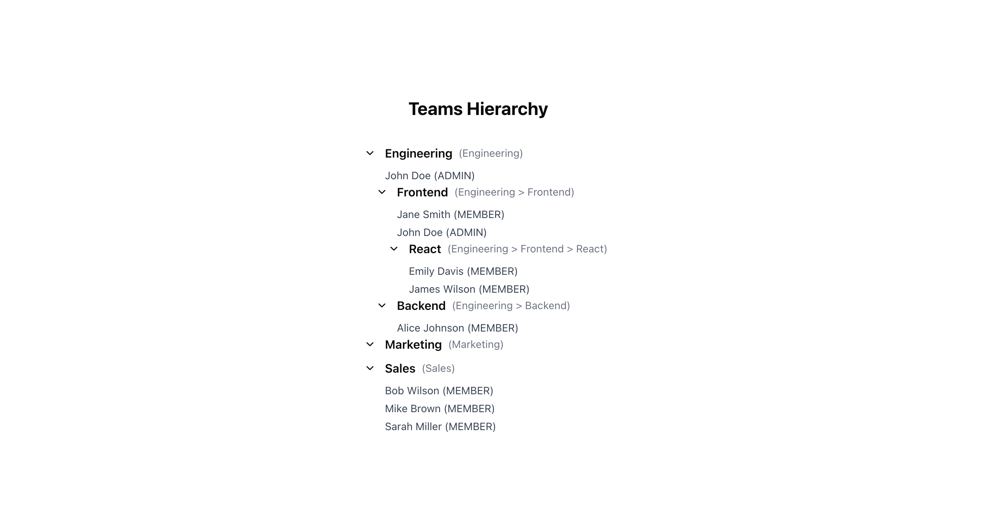
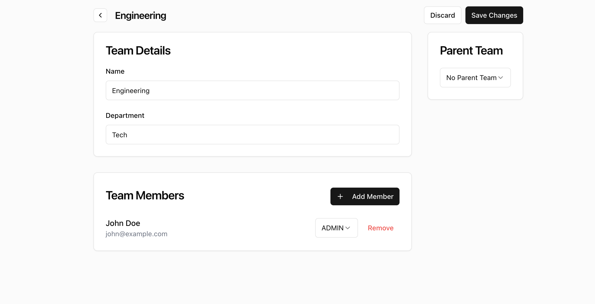

Using: Typescript, NextJS, Docker, Postgres, pg, React, Tailwind, shadcn/ui components

# Setup

## How to run
1. Copy `.env.example` to `.env`
2. Run `npm i`
3. Have docker running as an app in your pc (the postgres database is dockerized)
4. On one terminal run `npm run db:up` to run dockerized postgres
5. On another terminal run `npm run dev` to run the application
6. Visit `http://localhost:3000`
7. You should be able to see the homepage
8. Click on one of the team titles to visit the team edit page

If you want to destroy the db run and restart running the seed data run: `$ npm run db:down` and then `$ npm run db:up`

A seed file is run and the db is prefilled with data.

You should be able to all of the asked functionality:
1. Homepage Features
   - View teams in a hierarchical tree structure
   - See team members and their roles
   - Display full team path (e.g. Engineering > Frontend > React)

2. Team Management
   - Update team information (name, department)
   - Add/remove team members
   - Assign and modify member roles
   - Change team's parent organization

## Screenshots

# Design/technical decisions made
* Using NextJS as an alternative to Remix
* Using `pg` as mentioned in the exercise
* Using Typescript
* Using SSR to show the Homepage and the Team Edit page. Using fetch requests to save changes in the edit page as well as for adding a new member in a team
* For the UI I am using [shadcn UI](https://ui.shadcn.com/)

## Architecture
* `schema.sql` contains the SQL schema
* `seed.sql` contains is seed file for the database
* `/types/` contains type definitions for teams and users
* `/lib/queries/` contains raw SQL queries for teams and users
* `/lib/services/` contains service functions for executing the SQL queries
* `/lib/db` contains db connection
* `/components` contains React components
* `/components/ui` contains shadcnUI components
* `/components/edit-team/` contains components used in the Team Edit page
* `/pages/api/users/` contains the GET and POST APIs for users
* `/pages/api/teams/[id]` contains the PUT API for updating teams

## APIs
3 APIs exist
* PUT `/api/teams/[id]`: Updates team details (used when updating the details of a team) 
* POST `/api/users`: Creates a new user (used when creating a new member in the Team Edit page)
* GET `/api/users`: Fetches all users (not used)

## Homepage
* Visit: `http://localhost:3000/`
* Homepage can be found in the `index.tsx`
* Uses SSR using `getServerSideProps`
* `getServerSideProps` uses the `teamService` under `/lib/services/` to get data

## Team Edit page
* Visit: `http://localhost:3000/teams/[id]`
* Team edit page can be found under `/pages/teams/[id]/index.tsx`
* Uses SSR using `getServerSideProps`

# Query design decisions
* Used raw SQL queries instead of an ORM for direct control and transparency
* Separated queries into dedicated files under `/lib/queries/` for better organization and maintainability
* Used parameterized queries to prevent SQL injection
* Implemented transaction support for operations that modify multiple tables
* Added indexes on frequently queried columns (team_id, parent_id) to optimize performance
* Kept business logic in services layer (`/lib/services/`) separate from raw SQL queries for better separation of concerns

# Technical choices rationale

1. **NextJS & React**
   - Provides excellent SSR capabilities out of the box
   - Built-in API routes simplify backend integration
   - Great developer experience
   - Strong TypeScript support

2. **Docker**
   - Ensures consistent development environment
   - Easy database setup and teardown
   - Simplifies onboarding 
   - Portable across different operating systems

3. **Tailwind & shadcn/ui**
   - Rapid UI development with utility classes
   - Consistent styling across components
   - Highly customizable components
   - Good accessibility defaults
   - Reduced CSS maintenance overhead

4. **Architecture Decisions**
   - Services layer for business logic isolation
   - Separate query files for better SQL management
   - Component-based structure for reusability
   - API routes for clear client-server separation
   - Type definitions shared across frontend and backend

# Notes on production deployment considerations

1. **Database Optimization**
   - Configure connection pooling limits
   - Handle concurrent query loads
   - Implement deadlock prevention
   - Manage transaction isolation levels
   - Set up query timeout limits

2. **Testing Requirements**
   - Unit tests for services and utilities
   - Integration tests for API endpoints
   - E2E tests for critical user flows
   - Performance testing for database queries

3. **Code Robustness**
   - Input validation on all endpoints
   - Error handling and logging
   - Type checking and TypeScript strict mode

4. **Frontend Robustness**
   - Form validation and sanitization
   - Loading states for all async operations
   - Error boundaries for component error handling
   - Client-side data validation before submission

5. **CI/CD**
   - Set up automated build pipeline
   - Configure test automation in CI
   - Implement automated deployments
   - Add environment-specific configurations
   - Set up deployment approval process